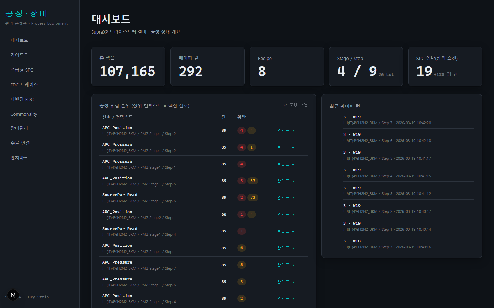
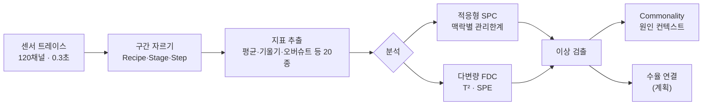
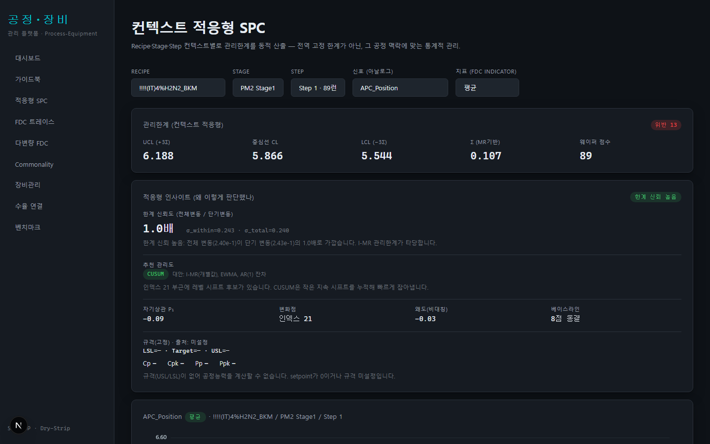
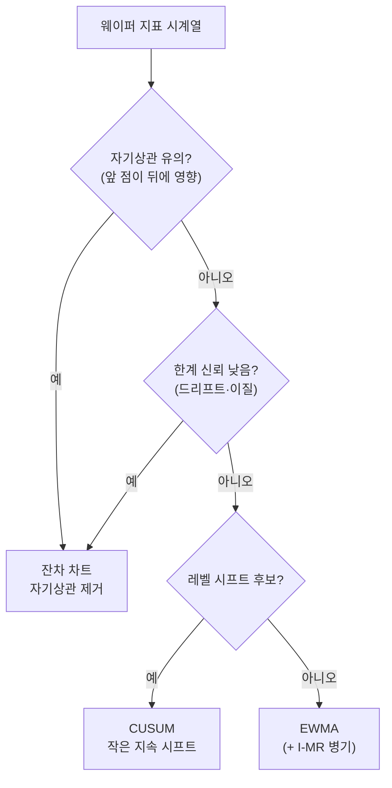
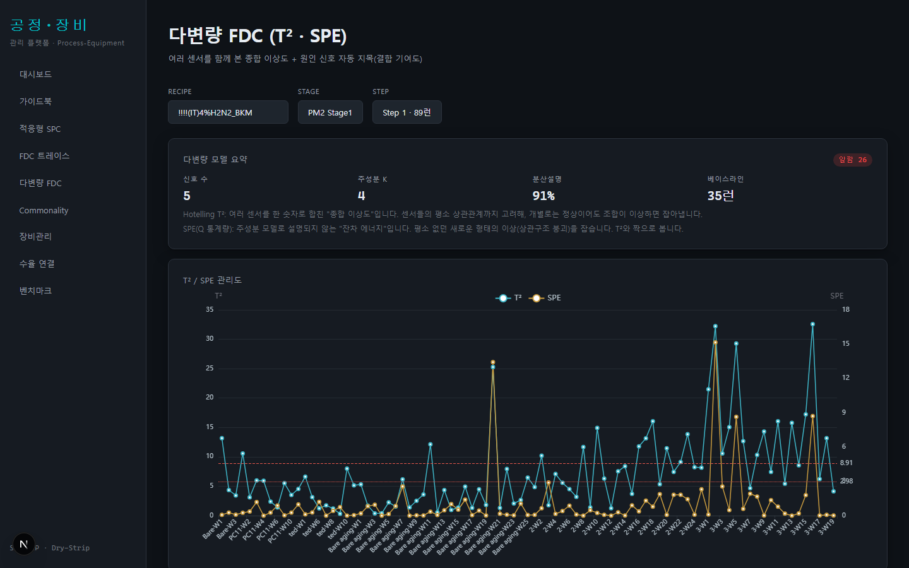
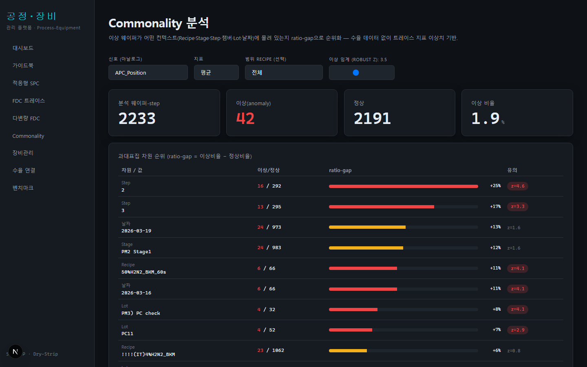
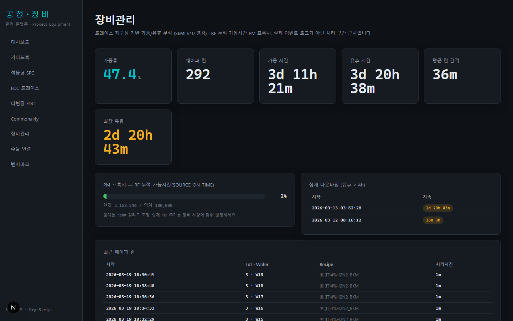
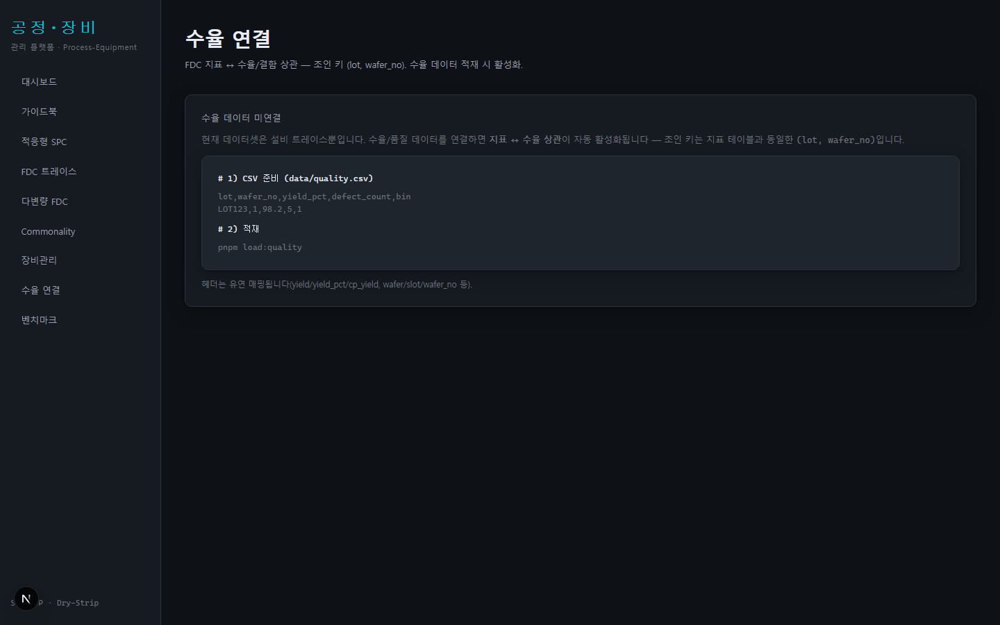
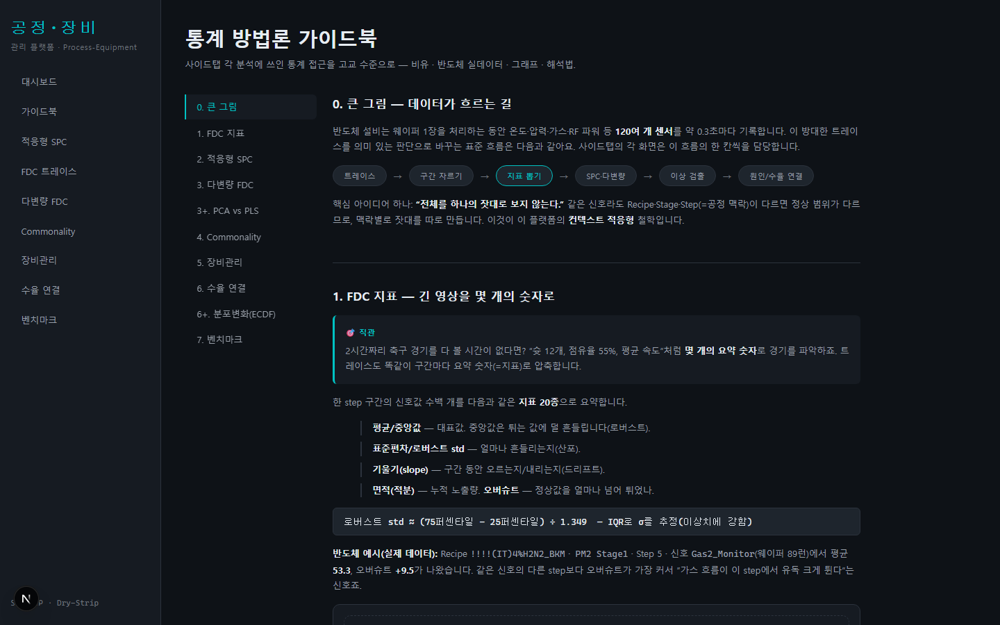
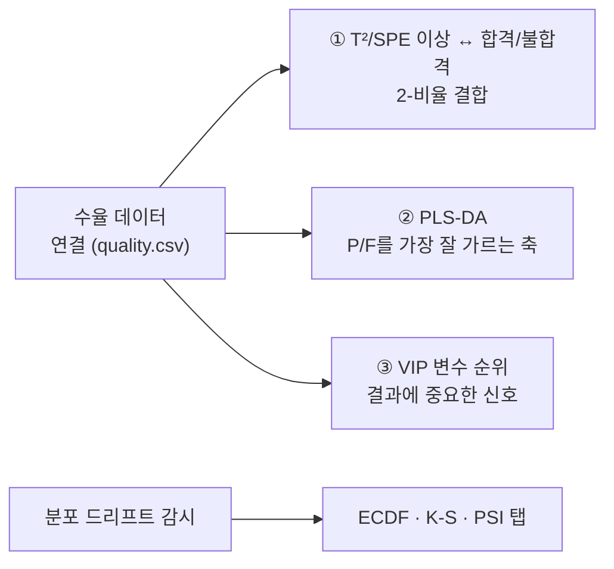

# 공정-장비 관리 플랫폼

> 반도체 **드라이스트립(애싱) 설비**의 고주파 센서 데이터를 "현장 엔지니어가 바로 판단할 수 있는 그림"으로 바꿔주는 웹 플랫폼입니다.
> 핵심은 **컨텍스트 적응형** — 전체를 하나의 잣대로 보지 않고, *공정 맥락(Recipe·Stage·Step)별로 정상 범위를 따로* 판단합니다.



---

## 🧭 이 플랫폼이 푸는 문제

설비 1대는 웨이퍼 한 장을 처리하는 동안 **120여 개 센서**(온도·압력·가스·RF 파워…)를 **약 0.3초마다** 기록합니다.
하루면 수십만 행이 쌓이죠. 이 방대한 데이터를 놓고 엔지니어가 답하고 싶은 질문은 결국 몇 가지입니다.

- **"지금 어디가 이상하지?"** → 대시보드 · 적응형 SPC
- **"이 이상, 어느 공정·챔버·Lot에 몰려 있지?"** → Commonality
- **"여러 센서가 같이 틀어진 건 아닐까?"** → 다변량 FDC
- **"장비는 얼마나 잘 돌고, 정비는 언제 하지?"** → 장비관리
- **"어떤 공정 변수가 수율과 연결되지?"** → 수율 연결(계획)

이 플랫폼은 그 질문마다 **화면(탭) 하나**로 답합니다.

### 데이터가 흐르는 길



> 💡 **핵심 아이디어 한 줄**: 같은 센서라도 Recipe가 다르면 정상값이 다릅니다(A레시피 53, B레시피 20).
> 그래서 **하나의 고정 잣대**를 쓰지 않고, **맥락별로 잣대를 따로** 만들어 "그 맥락 안에서" 이상을 판정합니다. 이게 **적응형**입니다.

---

## 📊 화면 안내

### 대시보드 — "지금 어디가 위험한가"
KPI(총 샘플·웨이퍼 런·SPC 위반)와 **공정 위험 순위**(상위 컨텍스트 × 핵심 신호)를 한눈에. 위반이 많은 조합부터 관리도로 바로 이동합니다.

### 적응형 SPC — "정상 범위를 데이터가 스스로 정한다"


Recipe→Stage→Step→신호→지표를 고르면, **그 맥락의 웨이퍼들로 관리한계를 동적으로 계산**해 보여줍니다.
- **관리한계(UCL/LCL) ≠ 규격(USL/LSL)** 을 명확히 구분
- 데이터를 진단해 **가장 적합한 관리도를 자동 추천**(이유 포함) — 아래 로직대로 움직입니다:


> 자동이되 **투명**합니다 — 왜 그 차트를 골랐는지 설명이 붙고, 대안도 함께 제시돼 엔지니어가 최종 판단합니다.

### FDC 트레이스 — "웨이퍼 원형 그대로 비교"
한 웨이퍼-스텝의 고주파 트레이스를 여러 신호로 **정규화 오버레이**. 모양이 평소와 다른 런을 눈으로 찾습니다.

### 다변량 FDC — "120개 신호를 2축으로 압축"


여러 센서를 **PCA로 압축**한 뒤 두 잣대로 봅니다.
- **T²** — 정상 패턴의 중심에서 얼마나 멀리 갔나
- **SPE/Q** — 정상 패턴 자체를 벗어났나(센서 관계가 깨진 새 고장)
- 경보가 뜨면 **기여도**로 "어느 서브시스템이 범인인지" 되짚습니다.

### Commonality — "이상이 어디에 몰려 있나"


이상 웨이퍼 집합이 어떤 **Step·챔버·Lot·날짜**에 과대표집됐는지 **ratio-gap**으로 순위화(불량 원인 좁히기). 통계적 유의성(2-비율 검정)과 최소 표본으로 노이즈를 걸러냅니다.

### 장비관리 — "얼마나 일하고 언제 정비하나"


트레이스로 **가동/유휴 타임라인을 재구성**(SEMI E10 영감)해 가동률·평균 런 간격·잠재 다운타임을 보여주고, **RF 누적 가동시간으로 PM(정비) 시점을 프록시**합니다.

### 수율 연결 — "공정 변수 ↔ 수율" (계획 · 데이터 연결 시 활성화)


FDC 지표와 수율/결함을 **웨이퍼 단위로 조인(lot + wafer_no)** 해 상관을 순위화합니다. 현재 데이터셋엔 수율이 없어 **조인 키·계약만 준비**돼 있고, `data/quality.csv`를 넣으면 바로 켜집니다.

### 벤치마크 — "검출법 성능 시험"
합성 결함을 주입해 정답을 알고, 정적 3σ vs EWMA vs CUSUM의 **재현율·정밀도·F1·ARL**을 겨룹니다. "우리 공정엔 어떤 방법이 맞나"를 근거로 고르게 해줍니다.

### 📖 가이드북 — "통계를 고교 수준으로"


위 모든 방법론의 통계 아이디어를 **비유 → 실데이터 예시 → 그래프 → 해석법 → 함정** 틀로 설명합니다.
PCA vs PLS, 누적분포(ECDF)로 변화 잡기 같은 **확장 개념**도 포함해, 데이터가 늘었을 때의 방향까지 제시합니다.

---

## 🧠 통계 아이디어 한눈에

| 화면 | 핵심 통계 | 쉽게 말하면 |
|---|---|---|
| FDC 지표 | 요약통계·로버스트(MAD/IQR) | 긴 영상을 몇 개 숫자로 |
| 적응형 SPC | I-MR·3σ·WE룰·Phase I/II·EWMA/CUSUM·Cpk | 반마다 커트라인 따로, 규격과 구분 |
| 다변량 FDC | PCA·Hotelling T²·SPE/Q·기여도 | 120과목을 2축으로 압축 |
| Commonality | 로버스트 z·ratio-gap·2-비율 검정 | 불량이 어느 반에 몰렸나 |
| 장비관리 | 구간 union·평균 간격·누적 마모 | 가동 시간표 합치기 |
| 수율 연결 | 피어슨/점이연 상관 (→ PLS-DA 확장) | 같이 움직이나 |
| 벤치마크 | ARL·정밀도/재현율/F1 | 화재경보기 성능시험 |

> 더 자세한 직관·수식·그래프는 앱의 **가이드북** 탭에서 확인하세요.

---

## 🚀 앞으로의 방향 (로드맵)

수율/품질 데이터가 연결되면 다음으로 확장됩니다.



- **수율 연결 활성화** — 상관을 넘어 **PLS-DA**(합격/불합격을 가장 잘 가르는 다변량 축)와 **VIP**(수율에 중요한 변수 순위)
- **분포 변화 감시** — 베이스라인 ECDF를 동결해 두고 현재와 **K-S/PSI**로 비교(평균은 그대로인데 꼬리만 두꺼워진 변화까지 포착)
- **다중 설비 모델 확장** — 현재 SupraXP 외 PRECIA·PROLITE·Supra Vplus로 (암호화 해제 데이터 확보 시)

---

## ⚙️ 기술 & 시작하기

- **스택**: Next.js(App Router) · TypeScript · DuckDB(분석 쿼리) · ECharts(차트)
- **데이터**: 원시 CSV·DB는 저장소에 올리지 않습니다(로컬 전용, `.gitignore` 처리).

```bash
pnpm install
pnpm ingest            # CSV → DuckDB (지표 테이블 포함)
pnpm dev               # http://localhost:3000

# 선택
pnpm build:indicators  # 기존 DB에 지표만 재빌드
pnpm load:quality      # data/quality.csv 있으면 수율 연결 활성화
pnpm test              # 통계 로직 단위 테스트
```

> 스크린샷 갱신: `pnpm dev` 실행 후 `node scripts/screenshots.mjs` → `docs/screenshots/*.png`

---

<sub>모든 화면·수치는 실제 SupraXP 설비 데이터에 기반합니다(수율 화면만 개념 예시). 통계 상세는 `docs/methodology.md` 참고.</sub>
